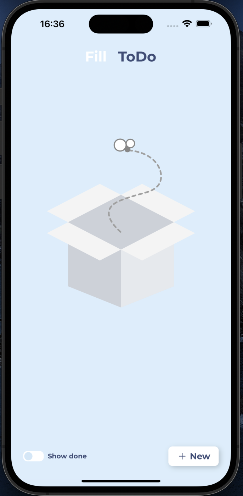
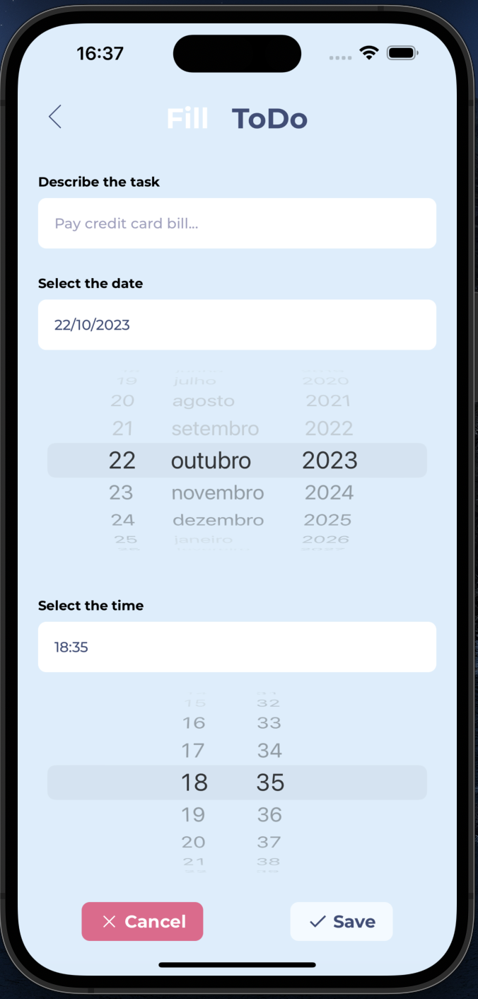
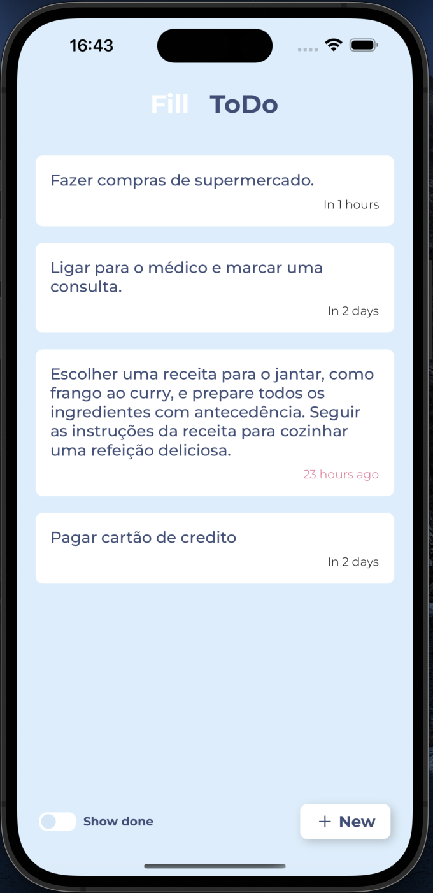
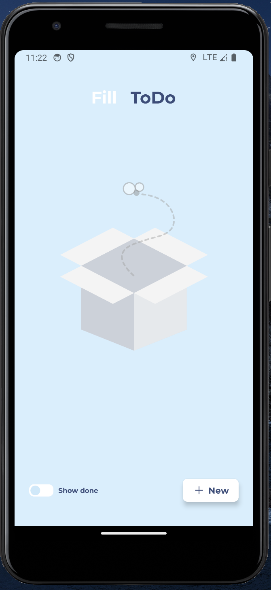
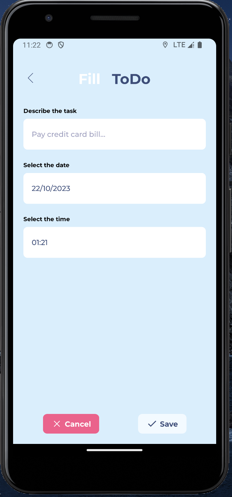
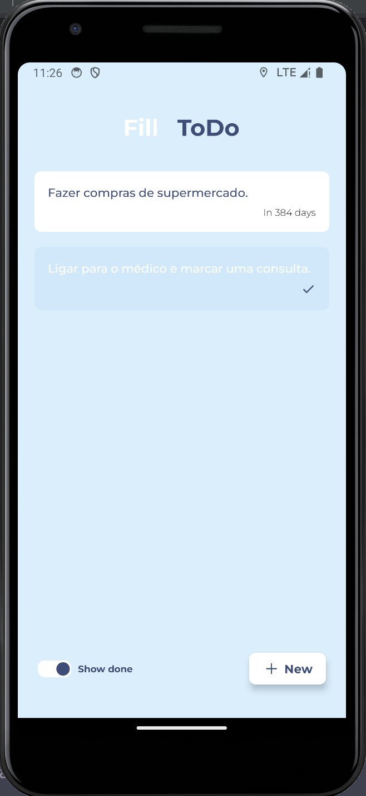

# Fill-todo

## Screenshots iOS

<p align="center">
    
    
    
    
</p>

## Screenshots Android

<p align="center">
    
    
    
</p>

## Tecnologias

- React Native
- Expo
- Zustand
- Async storage
- React Hook Form
- E mais...

---

## Instalação

Clone o projeto e acesse a sua pasta:

```sh
$ git clone https://github.com/thiagoemanoel98/fill-todo.git
$ cd fill-todo
```

Instale as dependências do projeto e inicie:

```sh
# Dependências
$ yarn start

# Start
$ npx expo start

```

---

Made with :coffee: by Thiago Emanoel :v:
